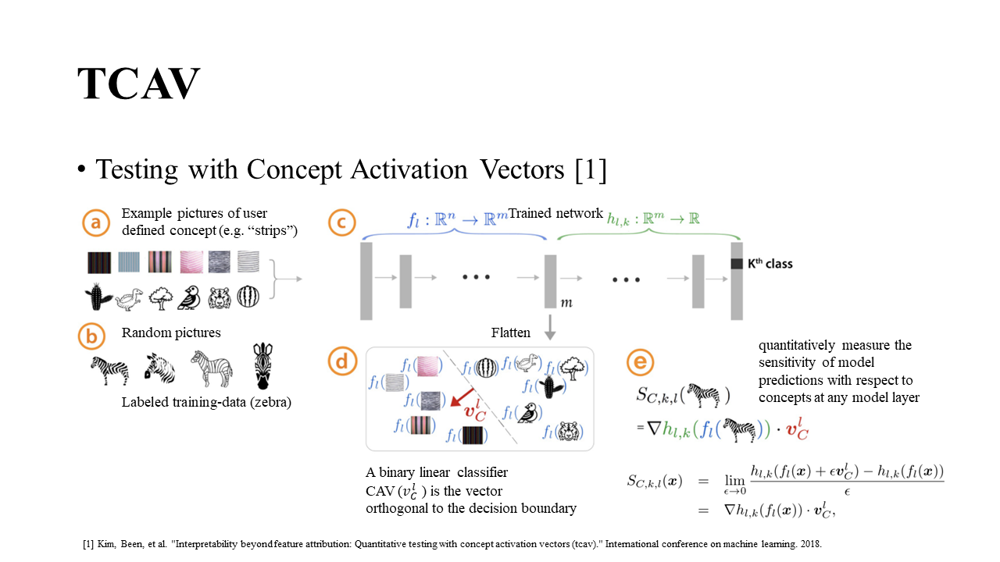

# TCAV-pytorch

A simple unofficial TCAV implementation using pytorch.

Please see the paper [Interpretability Beyond Feature Attribution: Quantitative Testing with Concept Activation Vectors (TCAV)](https://arxiv.org/abs/1711.11279).



## Data

* 5 sample pictures (zebra) from ImageNet are in ```imagenet_sample\imagenet_sample_5000```.

* Please down load the texture dataset from https://www.robots.ox.ac.uk/~vgg/data/dtd/index.html.
